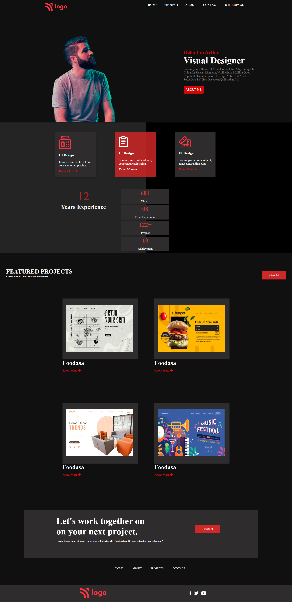

 # 15th HTML-CSS PROJECT

This project explores the use of the Flex property in HTML/CSS.

## Description

In this project, I have learnt using the Flex property, which is a powerful tool in CSS. With the Flex property, I was able to easily manipulate the arrangement of elements within a container, adjusting their size, alignment, and order as needed.

This Project is Responsive.

## Screenshot

